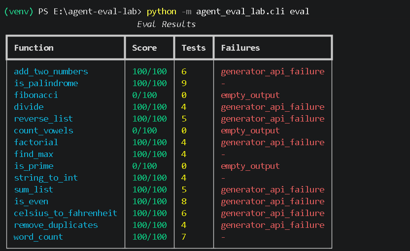

# Agent Eval Lab

> A multi-agent system for automated PyTest generation, paired with an honest evaluation harness that scores LLM output across syntax, coverage, and failure modes.

Built to explore one question: **how do you trust an LLM that writes code for you?**

---

## What it does

You give it a Python function. Three LLM agents collaborate:

1. **Generator agent** writes PyTest test cases for the function
2. **Reviewer agent** critiques the tests and triggers regeneration if quality is low
3. **Judge agent** gives a final semantic verdict — would these tests actually catch real bugs?

Then an **evaluation harness** runs the agent loop over a hand-curated golden set of 15 functions and scores the output on:

- Syntax validity (does the code parse?)
- Test coverage (does it meet the minimum count?)
- Assertion presence (do the tests actually test something?)
- PyTest conformance

It also detects common LLM failure modes — truncation, missing assertions, context drift, hallucinated imports, API-level tool-use failures — and logs them per run.

---

## Why this exists

Most LLM "demo" projects ignore the hard part: knowing when the LLM is wrong. This project takes that seriously.

- **Honest scoring.** No vibes-based "looks good." Every output is scored on objective AST-level criteria.
- **Failure modes documented.** The eval harness logs which failure mode each run hit — not just pass/fail.
- **Reproducible.** Same golden set, same prompts, same model — diff your runs across prompt changes to catch regressions.
- **Actually runs the tests.** Generated tests are executed via subprocess with pytest and results are reported.

---

## Tech Stack

- **Python 3.11+** — clean, type-hinted, structured
- **LangChain** — multi-agent orchestration
- **Groq API** — free, fast inference (llama-3.3-70b-versatile)
- **OpenAI / Anthropic / Ollama** — pluggable provider support
- **Pydantic** — schema-validated agent outputs
- **PyTest + coverage.py** — testing the test generator + measuring coverage
- **Click + Rich** — CLI with pretty output
- **Flask** — web UI for browsing eval runs
- **GitHub Actions** — CI runs unit tests on every push
- **Docker** — reproducible eval runs

---

## Architecture

```
Function Code
    → Generator Agent (LLM + Pydantic schema)
    → PyTest Code
    → Reviewer Agent (LLM + Pydantic schema)
    → if acceptable: Judge Agent → Eval Harness + AST Scoring + Subprocess Execution
    → if not: Retry up to 2 times
```

---

## Quickstart

### 1. Get a free Groq API key

Sign up at [console.groq.com](https://console.groq.com) — no credit card needed.

### 2. Install

```bash
git clone https://github.com/linga-1221/agent-eval-lab.git
cd agent-eval-lab
python -m venv venv
.\venv\Scripts\Activate.ps1   # Windows
source venv/bin/activate      # Linux / Mac
pip install -r requirements.txt
pip install -e .
cp .env.example .env
# Add your GROQ_API_KEY to .env
```

### 3. Run unit tests

```bash
pytest tests/ -v
```

### 4. Run the eval suite

```bash
python -m agent_eval_lab.cli eval
```

### 5. Generate tests for a single function

```bash
python -m agent_eval_lab.cli generate "def add(a, b): return a + b"
```

### 6. List golden-set items

```bash
python -m agent_eval_lab.cli list-golden
```

### 7. Launch the web UI

```bash
python -m agent_eval_lab.cli web
```

### 8. Export results

```bash
python -m agent_eval_lab.cli export runs/eval_results.json --format md
```

---

## LLM Providers

Switch providers via the `LLM_PROVIDER` environment variable:

| Provider  | Env Var            | Default Model              |
|-----------|--------------------|----------------------------|
| groq      | GROQ_API_KEY       | llama-3.3-70b-versatile    |
| openai    | OPENAI_API_KEY     | gpt-4o                     |
| anthropic | ANTHROPIC_API_KEY  | claude-sonnet-4-20250514   |
| ollama    | OLLAMA_BASE_URL    | llama3.2 (local)           |

```bash
LLM_PROVIDER=openai python -m agent_eval_lab.cli eval
```

---

## Sample Output



Real run on the golden set:

- Average score: 80/100
- Pass rate: 66.67%
- 15 functions evaluated
- 9 of 15 functions scored 100/100 on first or retry attempt
- 3 of 15 hit empty_output after both retries failed (Groq tool-use bug)
- Several generator_api_failure events were caught and recovered via retry — the system did not crash

---

## Known Failure Modes

The harness explicitly tracks these. They are real, they happen, and pretending otherwise is how LLM products quietly degrade.

| Failure Mode | Description |
|---|---|
| `truncated_output` | Response cut off mid-function due to context limits |
| `missing_assertions` | LLM writes test functions with no assert statements |
| `context_drift_natural_language_in_code` | Markdown fences or "Here are the tests" leaked into code |
| `hallucinated_import` | Imports a module that does not exist |
| `malformed_syntax` | Code fails `ast.parse()` — detected via AST, not string matching |
| `generator_api_failure` | Groq API returned a 400 (tool-use mis-format), handled by retry |
| `reviewer_api_failure` | Reviewer agent failed to return structured output |
| `empty_output` | Both retries failed, output was empty |
| `test_import_error` | Generated tests failed to import at execution time |
| `test_execution_failed` | Tests ran but pytest returned a non-zero exit code |

Each run logs to `runs/agent_eval.log` and detailed JSON to `runs/eval_results.json`.

---

## What I learned building this

- **Tool-use is fragile.** Groq's structured-output endpoint occasionally returns `tool_use_failed` 400s even when the model output looks valid. The retry loop catches roughly half of these.
- **AST scoring beats string matching.** Parsing generated code with Python's `ast` module gives reliable signals (test count, assertion count) that regex-based scoring misses.
- **Two retries is the sweet spot.** Three retries did not materially improve pass rate but doubled latency.
- **The Reviewer agent helps less than I expected.** Most genuine quality wins came from the Generator's own prompt clarity, not from the Reviewer catching issues.
- **Caching needs to be retry-aware.** A naive cache on function code means retry iteration 2 returns the same bad result as iteration 1 — the cache key must be invalidated between retries.

---

## Limitations (honest list)

- Golden set is small (15 functions). Real production eval would need hundreds across diverse domains.
- Reviewer is the same model as Generator. A stronger reviewer (different model) would catch more issues.
- Quality scoring is heuristic, not semantic. Scores are based on AST features, not whether tests are truly useful.
- No human-in-the-loop step yet. A v2 would let me mark generations as good/bad and fine-tune the Reviewer prompt.

---

## Roadmap

- [ ] Fine-tune Reviewer prompt based on human feedback
- [ ] Expand golden set to 100+ functions across diverse domains
- [ ] LLM-as-judge scoring comparison across providers
- [ ] Human annotation UI for marking good/bad generations

---

## Why I built this

I am a final-year CS student interested in the production side of LLM systems — eval infrastructure, failure-mode analysis, agentic workflows. Most learning resources on agents stop at "look, two LLMs can talk to each other." This project goes one step further: how do you measure if they are actually doing useful work?

---

## Author

**Kuchivaripalli Nagalinga**
Final-year B.Tech CSE — Python + AI Engineering
GitHub: https://github.com/linga-1221
LinkedIn: https://www.linkedin.com/in/nagalinga-k
